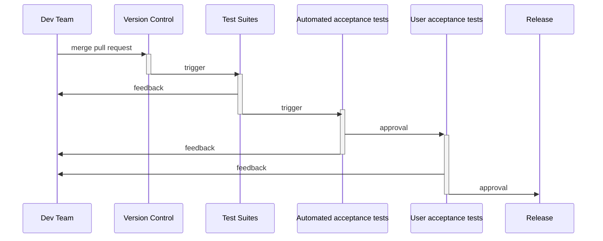

# CI/CD

## Introduction

### Continous Integration / Continous Delivery /(Deployment)

Continuous Delivery (CD) is a design practice used
in software development to automate and improve the
process of software delivery. (Wikipedia)

**Result:**

*"rapidly, reliably and repeatedly push out
enhancements and bug fixes to customers at low risk
and with minimal manual overhead."* (Wikipedia)

#### CD tools

- automated testing: unit and integration tests
- continous integration: continous build
- continous deployment: deploy to different environments
- configuration management

#### Components

- Local development environment: Workstation with the same build tools + IDE
- Source control: integration of the source code
- Continuous integration server: Creates the official binaries
- Configuration artifacts: Environment configuration + binaries = project
- Shared test environments: Development server environment, User Acceptance Test, Production like test environments
- Production

## Workflow example



### Deployment pipeline

Abstraction: automated manifestation of your process for getting
software from version control into the hands of your
users.


- Everything should be automatized (build from IDE is not a reference)
- Don’t Check In on a Broken Build
- Always Run All Commit Tests Locally before Committing, or Get Your CI Server to Do It for you
- Wait for commit tests to pass before moving on
- Never go home on a broken build
- Always be prepared to revert to the previous revision
- Don’t comment out failing tests
- Test-Driven Development
- Failing the build for slow tests
- Failing the build for warnings and Code Style Violations

### Continuous Integration

>A software development practice, where members of a team integrate their work frequently, usually each person integrates at least daily.
>
> Each integration is verified by an automated build (including test) to detect integration errors as quickly as possible.
>
>Martin Fowler

#### Principles

- Maintain a code repository
- Automate the build
- Make the build self-testing
- Everyone commits to the baseline every day
- Every commit (to baseline) should be built
- Keep the build fast
- Test in a clone of the production environment
- Make it easy to get the latest deliverables
- Everyone can see the results of the latest build
- Automate deployment

#### Difference between CI and CD

CI is the process of integrating code into a mainline code base. Implementing CI is as simple as using the right tools (git, github, etc...).

CD is more complicated. CD is about the processes that have to happen after code is integrated for app changes to be delivered to users. Those processes involving testing, staging and deploying code. There is no single type of tool that does all these things. These processes take different forms, depending on the culture of the team and the type of app it is creating.

## Practice

### How to run our application

`$ mvn spring-boot:run`

### How to put your application on the internet?

`ngrok http <port>`

### Intro to heroku

Deploying from command line, with `heroku-cli`.

Create the application with the heroku web app.

```bash
git init
git add .
git commit -m "first commit"

heroku git:remote -a <appname>
git push heroku master
```

[Connecting to Relational Databases on Heroku with Java](https://devcenter.heroku.com/articles/connecting-to-relational-databases-on-heroku-with-java)

Or on heroku webapp: Connect to GitHub...

Or you can [deploy a jar/war file](https://github.com/heroku/heroku-cli-deploy)

### Intro to GitHub actions

[Quickstart for GitHub Actions](https://docs.github.com/en/actions/quickstart)

### Use GitHub actions to implement CI/CD

## Jenkins

### Run Jenkins

```bash
> java -jar jenkins.war --httpPort=9090 --enable-future-java
```

ec41f87a6e244957adecd01a5d11783b

skip and continue as admin

### Change UI to english:

dashboard/ jenkins kezelese/ plugin manager/ + Locale

jenkins kezelese/ configure system/ locale 
